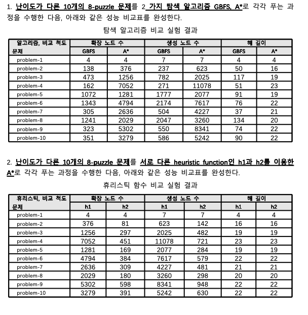

# 8-puzzle 탐색 알고리즘 성능 비교 분석 보고서

## 1. 탐색 알고리즘 비교 실험 결과 (GBFS vs A*)

| 알고리즘, 비교 척도 | 확장 노드 수 | | 생성 노드 수 | | 해 길이 | |
| :--- | :---: | :---: | :---: | :---: | :---: | :---: |
| **문제** | **GBFS** | **A\*** | **GBFS** | **A\*** | **GBFS** | **A\*** |
| problem-1 | 4 | 4 | 7 | 7 | 4 | 4 |
| problem-2 | 138 | 376 | 237 | 623 | 50 | 16 |
| problem-3 | 473 | 1256 | 782 | 2025 | 117 | 19 |
| problem-4 | 162 | 7052 | 271 | 11078 | 51 | 23 |
| problem-5 | 1072 | 1281 | 1777 | 2077 | 91 | 19 |
| problem-6 | 1343 | 4794 | 2174 | 7617 | 76 | 22 |
| problem-7 | 305 | 2636 | 504 | 4227 | 37 | 21 |
| problem-8 | 1241 | 2029 | 2047 | 3260 | 134 | 20 |
| problem-9 | 323 | 5302 | 550 | 8341 | 74 | 22 |
| problem-10 | 351 | 3279 | 586 | 5242 | 90 | 22 |

### 📌 GBFS와 A* 알고리즘 비교 분석

**GBFS (Greedy Best-First Search)**
- **특징**: 현재 위치에서 목표 상태까지 남은 예상 비용(휴리스틱 함수값)만을 기준으로 삼아, 당장 보기에 가장 좋아 보이는(비용이 적은) 노드를 우선적으로 탐색합니다. 지금까지 얼마나 걸어왔는지 누적 비용은 무시합니다.
- **분석 결과**: 표를 보면 GBFS는 대체로 A*에 비해 방문하는 노드(확장 및 생성 노드) 수가 더 적은 편입니다. 눈앞의 이익만 쫓아가기 때문에 최적해를 계산하려고 주변을 뒤지지 않아 연산 자체는 빨리 끝납니다. 하지만 해 길이를 보면 최적해가 아닌 빙빙 돌아가는 무지막지하게 긴 경로(예: problem-3에서 117)를 도달합니다. 탐색 속도는 빠를지 몰라도 도출된 해답의 퀄리티(최적해)를 전혀 보장하지 못합니다.
- **활용 분야**: 비디오 게임 NPC의 실시간 길찾기나 네트워크 경로 설정 등, '완벽한 최단 경로'보다는 약간 비효율적이더라도 '실시간으로 빠르게 적당한 결과'를 뽑아내야 하는 환경에서 주로 쓰입니다.

**A* (A-Star) 알고리즘**
- **특징**: 시작점에서 현재 노드까지 쓴 실제 비용(g)과 여기서 목표까지 더 가야 하는 예상 비용(h)을 더한 값(f = g + h)을 기준으로 탐색합니다. 즉 지금까지의 고생비용과 앞으로의 예상비용을 철저히 계산합니다.
- **분석 결과**: 앞선 실험에서 A*가 찾은 '해 길이'는 모든 문제에서 GBFS보다 훨씬 짧거나 같은 최적 길이입니다. 무조건 최단 경로를 찾아낸다는 훌륭한 장점이 있습니다. 하지만 그 길을 확신하기 위해 더 많은 주변 정보를 샅샅이 뒤져야 하므로(완전 탐색에 가까움), 어려운 문제(problem-4 등)로 갈수록 확장 노드 수가 GBFS에 비해 폭발적으로 늘어나 계산 시간과 메모리 부담이 막대해집니다.
- **활용 분야**: 차량용 네비게이션, 로봇청소기의 효율적 경로 계획, 퍼즐 해결 등 시간이 조금 들더라도 '가장 짧은 확실한 경로'를 반드시 보장해야 할 때 널리 쓰입니다.

 

## 2. 휴리스틱 함수 비교 실험 결과 (h1 vs h2)

> 두 실험 모두 똑같은 A* 알고리즘을 사용했고, 오직 휴리스틱 함수 추정 방식(h1 vs h2)만 바꿔서 테스트한 결과입니다.

| 휴리스틱, 비교 척도 | 확장 노드 수 | | 생성 노드 수 | | 해 길이 | |
| :--- | :---: | :---: | :---: | :---: | :---: | :---: |
| **문제** | **h1** | **h2** | **h1** | **h2** | **h1** | **h2** |
| problem-1 | 4 | 4 | 7 | 7 | 4 | 4 |
| problem-2 | 376 | 81 | 623 | 142 | 16 | 16 |
| problem-3 | 1256 | 297 | 2025 | 482 | 19 | 19 |
| problem-4 | 7052 | 451 | 11078 | 721 | 23 | 23 |
| problem-5 | 1281 | 169 | 2077 | 284 | 19 | 19 |
| problem-6 | 4794 | 384 | 7617 | 579 | 22 | 22 |
| problem-7 | 2636 | 309 | 4227 | 481 | 21 | 21 |
| problem-8 | 2029 | 180 | 3260 | 298 | 20 | 20 |
| problem-9 | 5302 | 598 | 8341 | 948 | 22 | 22 |
| problem-10 | 3279 | 391 | 5242 | 630 | 22 | 22 |

### 📌 휴리스틱 함수 성능 분석

- **해 길이 문제없음**: 표를 보면 h1을 쓰나 h2를 쓰나 결국 도출된 이동 횟수(해 길이)는 완전히 똑같습니다. A* 알고리즘 특성상 휴리스틱 함수가 목표를 과대평가하지만 않는다면 무조건 최적해를 찾아내기 때문입니다.
- **노드 확장수의 극단적 차이**: 반면 연산량 지표인 확장 노드 수와 생성 노드 수를 보면 엄청난 차이가 납니다. 똑같은 문제를 푸는데도 h2를 사용하면 h1을 사용할 때보다 헛짚는 과정(탐색하는 범위)이 획기적으로 줄어듭니다. (예: problem-4에서 h1은 무려 7052번 노드를 확장했지만, h2는 451번 만에 찾아냄)
- **왜 이런 결과가 나왔을까?**: 이는 h2가 h1보다 목표까지의 거리를 좀 더 타이트하고 정확하게 예측하는 '더 똑똑하고 우세한(Dominating)' 휴리스틱이기 때문입니다. (일반적으로 8-puzzle에서 틀린 타일 갯수만 세는 게 h1, 각 타일과 정답 칸의 물리적 거리를 계산하는 맨해튼 거리가 h2입니다.)
- **결론**: 쓸데없이 주변에 곁눈질하며 노드를 확장하는 일을 똑똑한 휴리스틱이 사전에 컷해주기 때문에, A* 알고리즘의 최대 단점이었던 '무지막지한 연산 자원 소모' 문제를 압도적으로 개선할 수 있습니다. 즉, 퍼포먼스를 위해서는 훌륭한 휴리스틱의 설계가 알고리즘 자체만큼 중요하다는 것을 잘 보여줍니다.
